# Notebooks on MaxwellBloch

A set of Jupyter Notebooks on the [MaxwellBloch](https://github.com/tommyogden/maxwellbloch/) package.

> MaxwellBloch is a Python package for solving the coupled Maxwell-Bloch
> equations describing the nonlinear propagation of near-resonant light through
> thermal atomic vapours.

## Index

### Introduction

[00: Solve the Schrödinger Equation for the Two-Level System][00]
[01: Solve the Two-Level System with a Time-Dependent Interaction][01]
[02: Solve the Optical Bloch Equations with Spontaneous Decay][02]

### Solve the Optical Bloch Equations

| Notebook | Output |
| --- | --- |
| [03: Rabi Oscillations in a Two-Level System][03] | 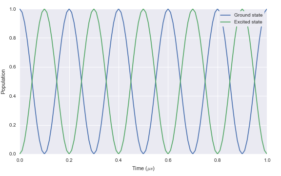 |
| [04: Time-Dependent Interaction with a Two-Level System][04] |  |
| [05: Two-Level System with Spontaneous Decay][05] |  |
| [06: The Lambda-Type Three-Level System][06] | 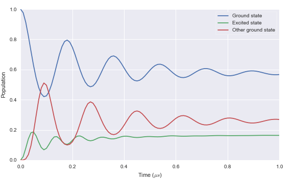 |

### Solve the Maxwell-Bloch Equations for a Two-Level System

| Notebook | Output |
| --- | --- |
| [Weak Pulse through Very Few Atoms][wpfa] | 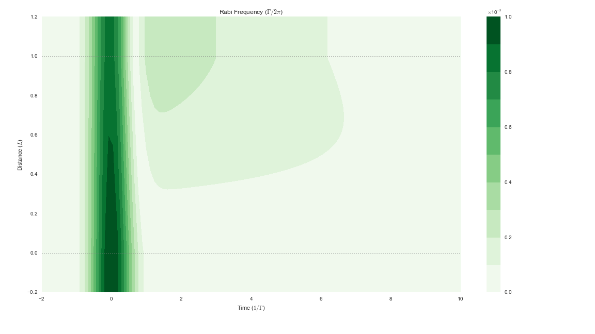
| [Weak Pulse through Few Atoms][wpfa] | 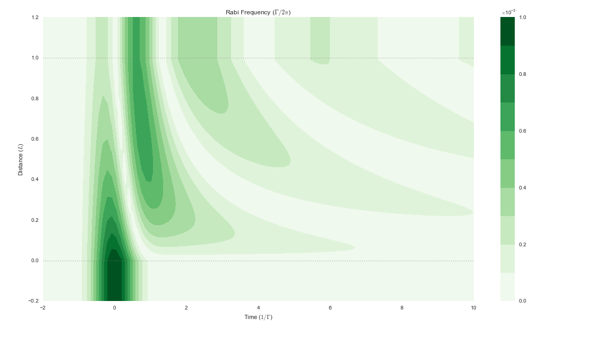
| [Weak Pulse through Some Atoms][wpsa] | 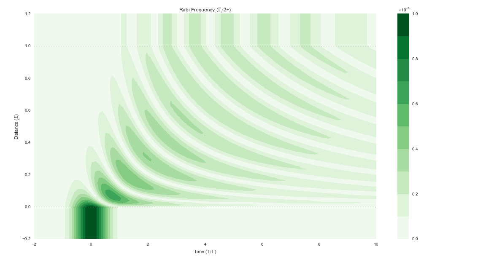 |
| [Weak Pulse through More Atoms][wpma] | 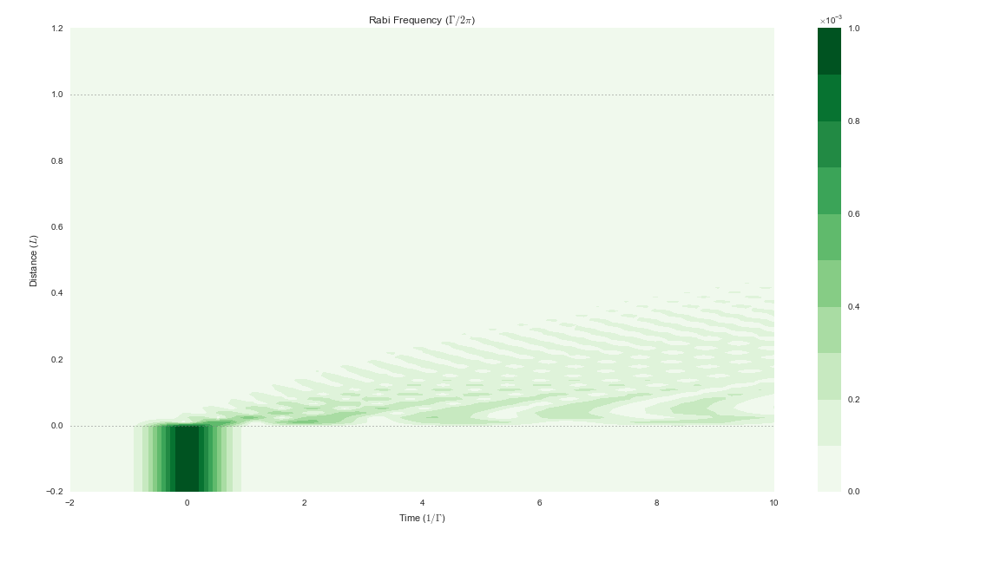 |
| [Weak Pulse through Some Atoms with Decay][wpsad] | 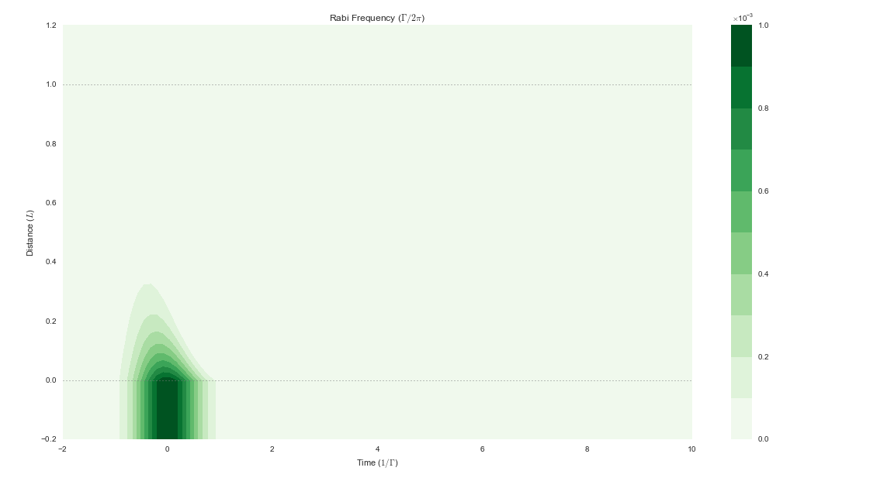 |
| [0.5π Sech Pulse][sech-0.5] | 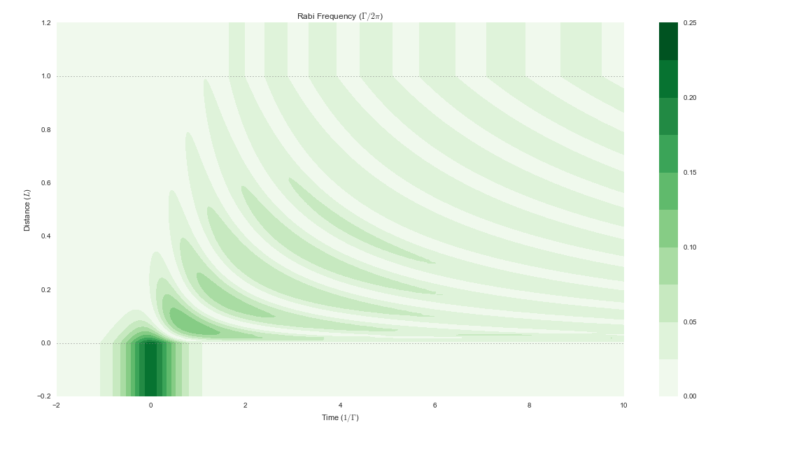 |
| [1.5π Sech Pulse][sech-1.5] | 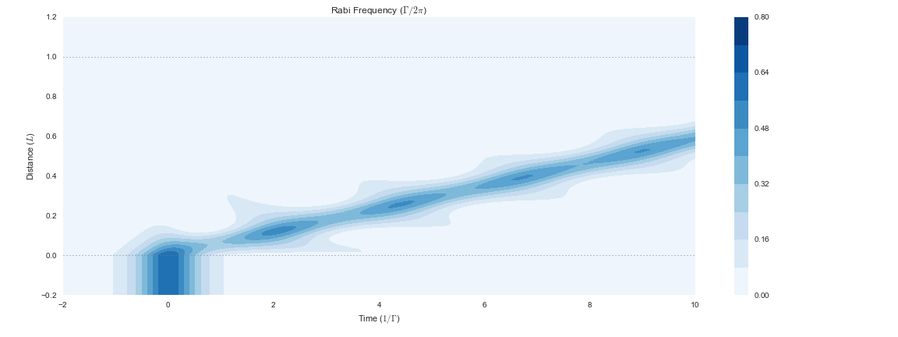 |
| [2π Sech Pulse: Self-Induced Transparency][sech-2] | 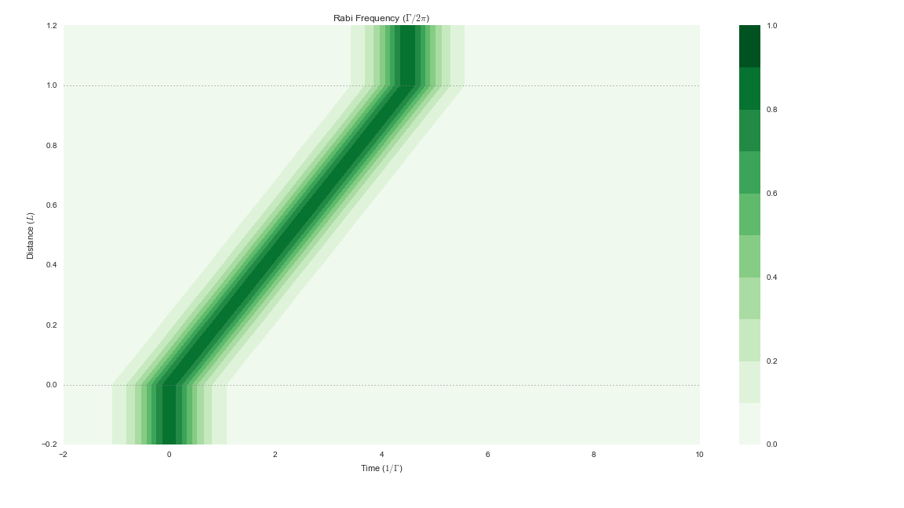 |
| [4π Sech Pulse: Breakup][sech-4] | 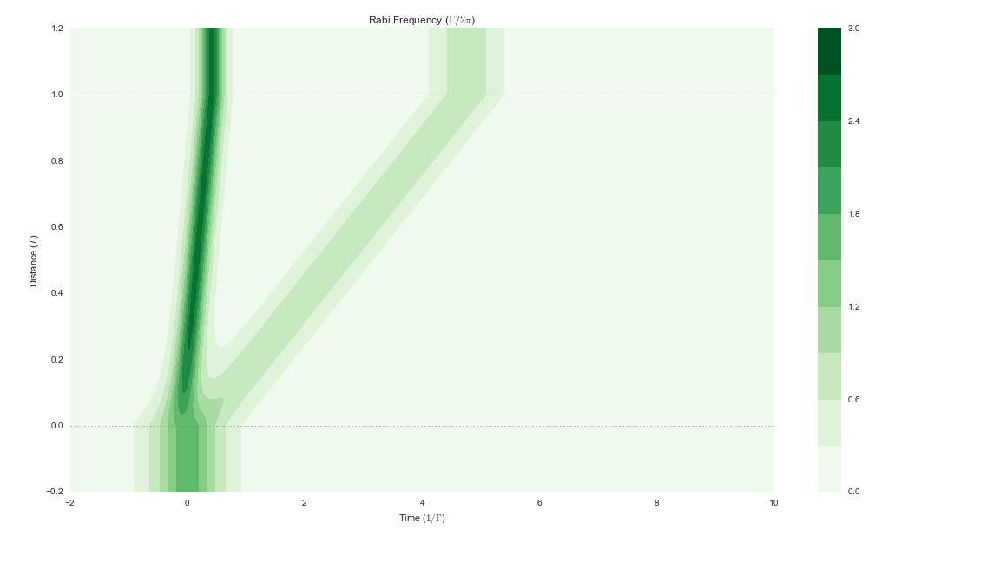 |
| [6π Sech Pulse][sech-6] | 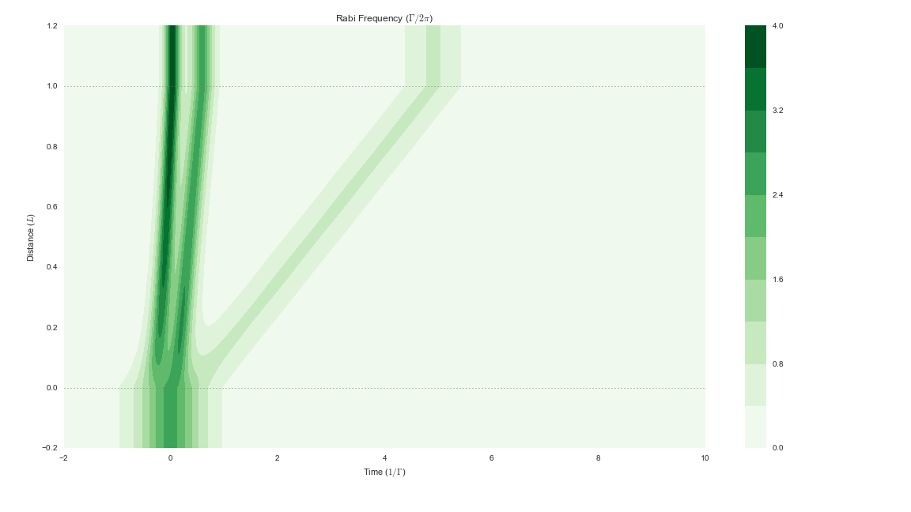 |
| [2π Sech Pulse with Decay][sech-2d] | 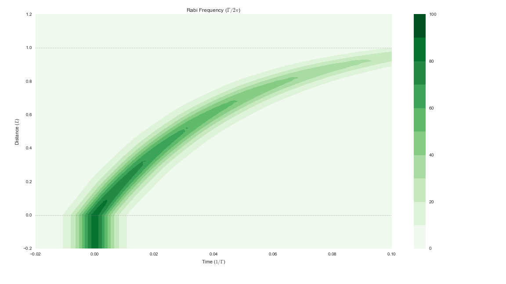 |

### Solve the Maxwell-Bloch Equations for a Λ-Type Three-Level System

| Notebook | Output |
| --- | --- |
| [Weak Pulse, No Coupling][wpnc] | 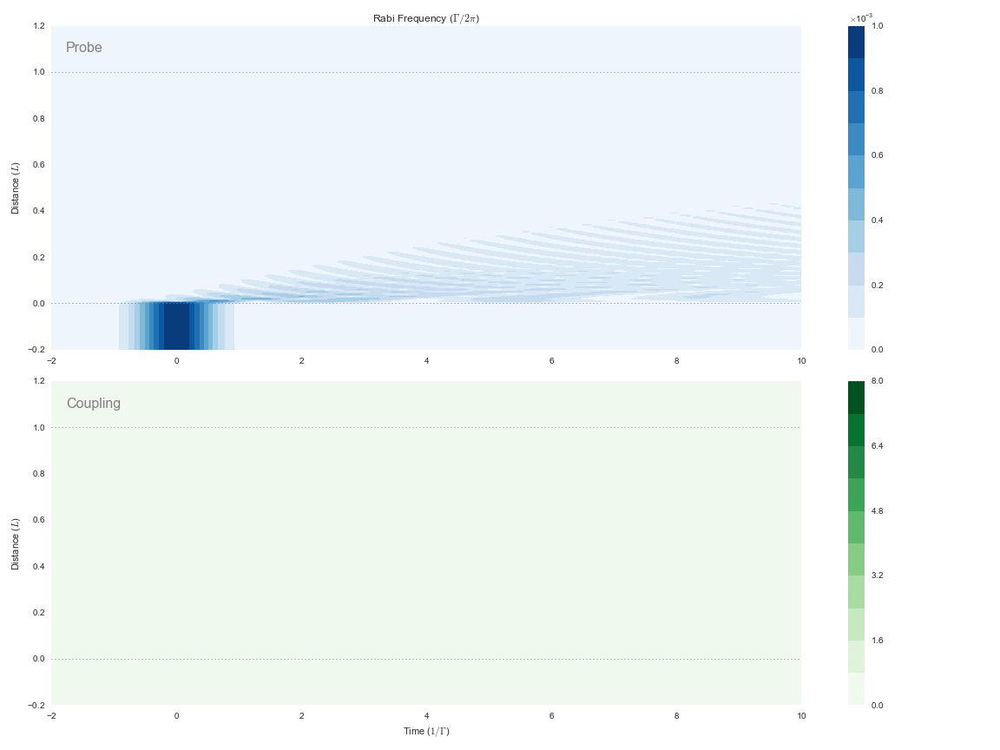 |
| [Pulse Compression][pc] | 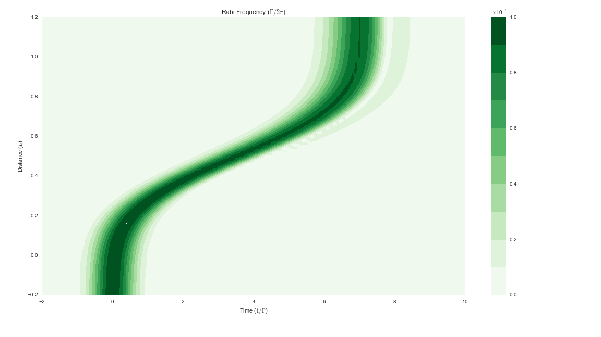

###  Appendices

| Notebook | Output |
| --- | --- |
| [A: Available Time Functions][A] | 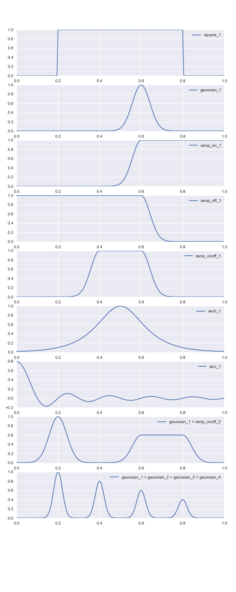 |

<!-- [B: Loading from JSON Files and Saving to QuTiP Files][B] -->

## References

[00]: 00-solve-the-schroedinger-equation-for-the-two-level-system.ipynb
[01]: 01-solve-the-two-level-system-with-time-dependent-interaction.ipynb
[02]: 02-solving-the-optical-bloch-equations.ipynb

[03]: 03-ob-solve-two-rabi-oscillations.ipynb
[04]: 04-ob-solve-two-tfunc-square.ipynb
[05]: 05-ob-solve-two-tfunc-square-decay.ipynb

[06]: 06-ob-solve-lamda-on-resonance.ipynb

[wpvfa]: mb-solve-two-weak-pulse-very-few-atoms.ipynb
[wpfa]: mb-solve-two-weak-pulse-few-atoms.ipynb
[wpsa]: mb-solve-two-weak-pulse-some-atoms.ipynb
[wpma]: mb-solve-two-weak-pulse-more-atoms.ipynb
[wpsad]: mb-solve-two-weak-pulse-some-atoms-decay.ipynb

[sech-0.5]: mb-solve-two-sech-0.5pi.ipynb
[sech-1.5]: mb-solve-two-sech-1.5pi.ipynb
[sech-2]: mb-solve-two-sech-2pi.ipynb
[sech-4]: mb-solve-two-sech-4pi.ipynb
[sech-6]: mb-solve-two-sech-6pi.ipynb
[sech-2d]: mb-solve-two-sech-2pi-narrower-even-more-atoms-decay.ipynb

[wpnc]: mb-solve-lambda-weak-pulse-more-atoms-no-coupling.ipynb
[wpsc]: mb-solve-lambda-weak-pulse-more-atoms-some-coupling.ipynb
[pc]: mb-solve-lambda-weak-pulse-cloud-atoms-some-coupling.ipynb

[A]: A-available-time-functions.ipynb
<!-- [B]: B-loading-from-json-and-saving-qu.ipynb -->